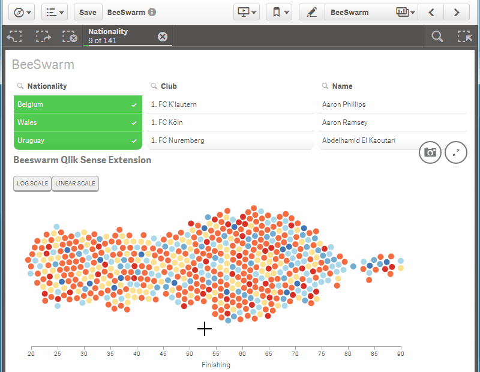

BeeSwarm
==========

Beeswarm chart based on d3v4 using d3.forcesimulation.  A sample QVF based on FIFA 14 data is provided.

In short, a beeswarm plot is a one-dimensional plot, that is, a plot where just one axis contains information. Unlike a stripchart, the points don’t overlap in a beeswarm plot.

Qlik Sense BeeSwarm extension in action

Dimensions
----------

1) Name - The unique name or id of the entity to be plotted in the swarm.  In the example attached, this is the Player Name. 
2) Grouping - The grouping determines the colour used for the first dimension.  In the example attched, this is the Player Nationality.

Measures
--------

1) Measure - Used on the single axis, usually an average or sum.

Options
-------

1) Color - Determines the gradient used for Grouping (Dimension 2) - Sequential, Diverging, Blues, Reds, or Yellow/Green/Blue. 
2) Bubble Size - Determines the bubble size used in the plot (1 to 10). 
3) Scale Type - Log or Linear - can be useful when isolating bunches of points.

Functionality
-------------

The beeswarm plots points onto a single axis using force collision functionality provided by Mike Bostock using v4 of the d3js javascript library.

Seletions can be made by brushing on the chart.  The selections are Qlik Sense selections and the QIX engine processes them accordingly.

Future improvements:
--------------------

1) Dynamic bubble size based on size of visualisation, number and density of points. 
2) Performance starts to degrade when above 2000 single points, improvements on the force collision algorithm could improve this. 
3) Log and Linear scale buttons available in the viz itself.  These have been removed for now due to performance issues. 
4) Hovering on a point highlights and/or selects all points within the grouped dimension. 
5) Incorporate data paging for > 3333 points.  Although this data volume is probably too much to make sensible conculsions with a beeswarm.

